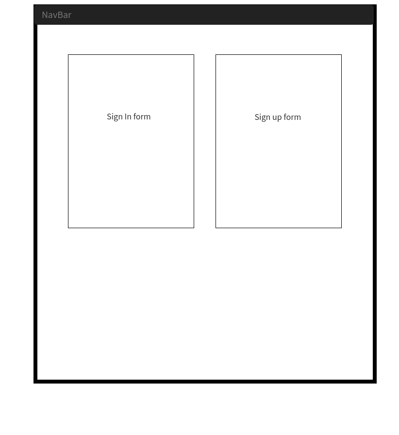
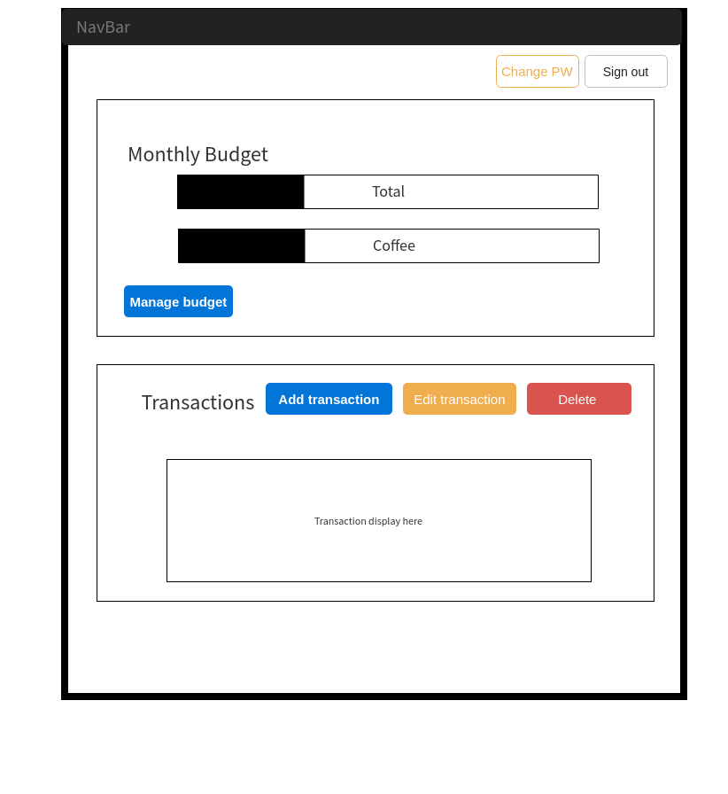
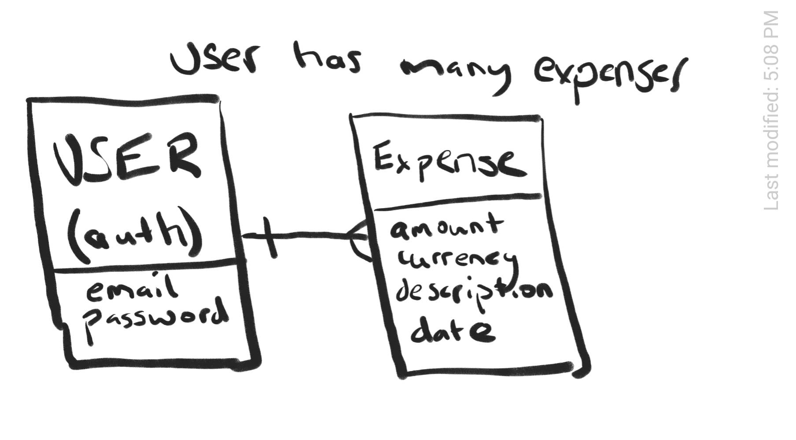

# Finance management tracker - Rails API

## App Summary
A financial management app that currently allows the user to have personalized transactions that they can input to track. It displays all your transactions in list format, complete with date, amount, currency and description of the transaction.

***Expense actions currently supported:***
- Index
- Show
- Create
- Update
- Destroy

#### Technologies
Ruby, Rails, RSpec

PosgreSQL

## Links
**Deployed front-end client:** https://marcpelve.github.io/front-end-finance-tracker/

**Front-end client repository:** https://github.com/marcpelve/front-end-finance-tracker

**Deployed back-end API:** https://protected-castle-96334.herokuapp.com

**Back-end API repository:** https://github.com/marcpelve/back-end-finance-tracker

## Development documentation

### Wireframes && User stories && ERDs

Wireframes

User stories

As a user, I want to be able to sign in.
As a user, I want to be able to log in.
As a user, I want to be able to change passwords.
As a user, I want to be able to sign out.

As a user, I want to be able to see all my transactions.
As a user, I want to be able to create a transaction.
As a user, I want to be able to edit a transaction.
As a user, I want to be able to delete a transaction.
As a user, I want to be able to set a budget.
As a user, I want to see a very basic budget analysis of the month.

ERD

`Users` -|--< `Expenses`

**Expenses** belong to **User**

**User** has many **Expenses**

### API - Backend
##### Setup and intialize to local/remote and heroku
Change information, where need be, with proper project name.
   - `config/application.rb` contains app module name
   - `config/database.yml` contains project database name

##### Resource planning
Create resource required for project.
- `User` resource provided for authentication
- `Expense` resource to be created as primary resource
  - Protected resource will require to inherit from Protected Controller

  `Users` -|--< `Expenses`

  **Expenses** belong to **User**

  **User** has many **Expenses**

  <table style="display:inline">
  <th colspan="2" style="text-align:center">Expenses</th>
  <th colspan="2" style="text-align:center">User</th>
  <tr>
  <td>id</td>
  <td>primary key</td>
  <td>id</td>
  <td>primary key</td>
  </tr>
  <tr>
  <td>amount</td>
  <td>integer</td>
  <td>email</td>
  <td>string</td>
  </tr>
  <tr>
  <td>currency</td>
  <td>string</td>
  <td>password</td>
  <td>string</td>
  </tr>
  <tr>
  <td>description</td>
  <td>string</td>
  <td>password_confirmation</td>
  <td>string</td>
  </tr>
  <tr>
  <td>user_id</td>
  <td>foreign key</td>
  <td></td>
  <td></td>
  </tr>
  <tr>
  <td>transaction_date</td>
  <td>date</td>
  <td></td>
  <td></td>
  </tr>
  <tr>
  <td>created_at</td>
  <td>datetime</td>
  <td>created_at</td>
  <td>datetime</td>
  </tr>
  <tr>
  <td>updated_at</td>
  <td>datetime</td>
  <td>updated_at</td>
  <td>datetime</td>
  </tr>
  </table>

##### End Point Testing
Create curl scripts to test routing and resource end points

<ul style="list-style-typenone;">
  <li>get -> #index, #show</li>
  <li>post -> #create</li>
  <li>patch -> #update</li>
  <li>delete -> #destroy</li>
</ul>

### Project problem realizations
I tried to create a full search bar that supports multiple tables and multiple columns, however I had written the code in such a way that didn't properly escape the inputed data. This made it vunlernable to SQL injections. So as to not waste too much time I moved away from a feature that wasn't critical to the app and dropped it for later development.

#### Potential updates
1. Resource `profile` with to allow more constraints for data manipulation
2. Custom routes and/or queries on route for new data manipulation
3. Use 3rd party API for more app functionality
